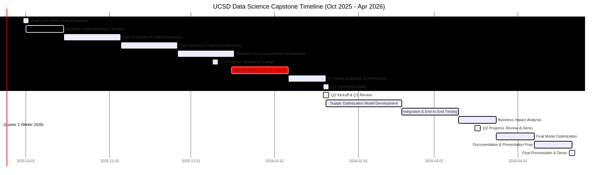

A clear schedule of all major project milestones and deadlines for the two-quarter capstone project. This timeline reflects an industry partnership model where Intuit serves as an advisory partner, providing guidance, feedback, and real-world context rather than formal academic grading.

## Project Roadmap


*Figure 1: Complete project timeline showing all phases, milestones, and the holiday break period*

<!-- ```mermaid
gantt
    title UCSD Data Science Capstone Timeline (Oct 2025 - Apr 2026)
    dateFormat  YYYY-MM-DD
    section Quarter 1 (Fall 2025)
    Project Kickoff & Team Formation       :milestone, kickoff, 2025-10-01, 0d
    Business Understanding & Scoping       :active,    q1p1, 2025-10-01, 14d
    Data Acquisition & Initial Exploration :          q1p2, 2025-10-15, 21d
    Data Cleaning & Feature Engineering    :          q1p3, 2025-11-05, 21d
    Demand Forecasting Model Development   :          q1p4, 2025-11-26, 21d
    Q1 Progress Review & Findings          :milestone, q1review, 2025-12-10, 0d
    Holiday Break (Dec 16 - Jan 5)         :crit,     holiday, 2025-12-16, 21d
    Q1 Model Evaluation & Refinement       :          q1p5, 2026-01-06, 14d
    Q1 Final Deliverables                  :milestone, q1final, 2026-01-20, 0d

    section Quarter 2 (Winter 2026)
    Q2 Kickoff & Q1 Review                 :milestone, q2kick, 2026-01-20, 0d
    Supply Optimization Model Development  :          q2p1, 2026-01-20, 28d
    Integration & End-to-End Testing       :          q2p2, 2026-02-17, 21d
    Business Impact Analysis               :          q2p3, 2026-03-10, 14d
    Q2 Progress Review & Demo               :milestone, q2review, 2026-03-17, 0d
    Final Model Optimization               :          q2p4, 2026-03-24, 14d
    Documentation & Presentation Prep      :          q2p5, 2026-04-07, 14d
    Final Presentation & Demo              :milestone, final, 2026-04-21, 0d
``` -->

## Detailed Milestones

### Quarter 1 (Fall 2025): Demand Forecasting Foundation

| Phase | Duration | Key Deliverables | Success Criteria |
|-------|----------|------------------|------------------|
| **Project Kickoff** | Oct 1, 2025 | Team formation, project charter, stakeholder alignment | Clear project scope and team roles defined |
| **Business Understanding** | Oct 1-14, 2025 | Business requirements document, success metrics definition | Stakeholder sign-off on requirements |
| **Data Exploration** | Oct 15-Nov 4, 2025 | Data quality report, exploratory data analysis | Understanding of data characteristics and limitations |
| **Feature Engineering** | Nov 5-25, 2025 | Feature engineering pipeline, data preprocessing code | Clean, processed dataset ready for modeling |
| **Model Development** | Nov 26-Dec 16, 2025 | Multiple forecasting models (ARIMA, Prophet, LSTM, etc.) | Baseline models with initial performance metrics |
| **Q1 Progress Review** | Dec 10, 2025 | Progress presentation, findings showcase, stakeholder feedback | Demonstrable progress on forecasting models with industry advisor input |
| **Holiday Break** | Dec 16, 2025 - Jan 5, 2026 | **NO WORK** - Team vacation period | Team rest and recharge |
| **Model Refinement** | Jan 6-20, 2026 | Optimized forecasting model, validation results | Best-performing model selected with RMSE < target |

### Quarter 2 (Winter 2026): Supply Optimization & Integration

| Phase | Duration | Key Deliverables | Success Criteria |
|-------|----------|------------------|------------------|
| **Q2 Kickoff** | Jan 20, 2026 | Q1 review, Q2 planning, stakeholder feedback | Clear roadmap for optimization phase |
| **Optimization Development** | Jan 20-Feb 16, 2026 | Staffing optimization models, constraint definitions | Working optimization model with business constraints |
| **Integration & Testing** | Feb 17-Mar 9, 2026 | End-to-end pipeline, integration testing | Integrated system with demand forecasting + optimization |
| **Business Impact Analysis** | Mar 10-23, 2026 | Cost-benefit analysis, ROI projections | Quantified business value and cost savings |
| **Q2 Progress Review** | Mar 17, 2026 | Progress presentation, integrated system demo, stakeholder feedback | Functional end-to-end solution demonstrated with industry advisor guidance |
| **Final Optimization** | Mar 24-Apr 6, 2026 | Production-ready models, performance tuning | Optimized system meeting all success criteria |
| **Documentation & Prep** | Apr 7-20, 2026 | Final report, presentation materials, demo video | Complete documentation package ready |
| **Final Presentation** | Apr 21, 2026 | Final presentation, stakeholder demo, Q&A | Project completion and stakeholder approval |

## Key Dates & Deadlines

### Quarter 1 (Fall 2025)
- **Oct 1, 2025**: Project kickoff and team formation
- **Oct 15, 2025**: Business requirements finalized
- **Nov 15, 2025**: Data exploration complete, initial findings presented
- **Dec 10, 2025**: Q1 Progress Review & Findings presentation (demand forecasting progress)
- **Dec 16, 2025 - Jan 5, 2026**: **Holiday Break** (no work)
- **Jan 20, 2026**: Q1 deliverables due (forecasting model + documentation)

### Quarter 2 (Winter 2026)
- **Jan 20, 2026**: Q2 kickoff and Q1 review
- **Feb 16, 2026**: Supply optimization model complete
- **Mar 17, 2026**: Q2 Progress Review & Demo (integrated system showcase)
- **Apr 6, 2026**: Final deliverables due (complete system + analysis)
- **Apr 21, 2026**: Final presentation and project completion

## Risk Mitigation & Contingency Planning

### High-Risk Areas
1. **Data Quality Issues**: Allocate extra time in Q1 for data cleaning and validation
2. **Model Performance**: Plan for multiple model iterations and fallback approaches
3. **Integration Complexity**: Start integration testing early in Q2
4. **Stakeholder Alignment**: Schedule regular check-ins and feedback sessions with industry advisors
5. **Holiday Break Impact**: Ensure Q1 deliverables are complete before Dec 16 break
6. **Post-Holiday Re-engagement**: Plan for team re-engagement and context recovery

### Buffer Time
- **Q1**: 1 week buffer before progress review presentation + 1 week before holiday break
- **Q2**: 1 week buffer before final presentation
- **Holiday Break**: 3-week break (Dec 16 - Jan 5) with no work expectations
- **Overall**: 2 weeks of contingency time distributed across phases

## Success Metrics Timeline

| Milestone | Demand Forecasting RMSE | Optimization Service Level | Documentation Quality |
|-----------|-------------------------|---------------------------|----------------------|
| Q1 Progress Review (Dec 10, 2025) | < 15% | N/A | 70% complete |
| Q1 Final (Jan 20, 2026) | < 10% | N/A | 90% complete |
| Q2 Progress Review (Mar 17, 2026) | < 10% | > 85% | 95% complete |
| Final (Apr 21, 2026) | < 8% | > 90% | 100% complete |

## Industry Partner Advisory Model

### **Intuit's Role as Industry Partner**
- **Advisory Guidance**: Provide real-world business context and technical expertise
- **Progress Reviews**: Regular check-ins to assess progress and provide feedback
- **Stakeholder Perspective**: Ensure solutions align with actual business needs
- **Mentorship**: Guide students through industry best practices and methodologies
- **Resource Support**: Provide access to relevant data, tools, and domain expertise

### **Student Team Responsibilities**
- **Self-Directed Learning**: Take ownership of project execution and problem-solving
- **Regular Updates**: Present progress and findings to industry advisors
- **Feedback Integration**: Incorporate advisor feedback into project iterations
- **Professional Development**: Learn industry practices and real-world application
- **Deliverable Quality**: Maintain high standards for all project outputs

### **Review Sessions Format**
- **Q1 Progress Review (Dec 10, 2025)**:
  - Present demand forecasting findings and initial models
  - Receive feedback on approach and technical direction
  - Discuss business relevance and practical applications

- **Q2 Progress Review (Mar 17, 2026)**:
  - Demo integrated system with both forecasting and optimization
  - Present business impact analysis and cost-benefit projections
  - Gather final feedback for project refinement

- **Final Presentation (Apr 21, 2026)**:
  - Comprehensive project showcase to stakeholders
  - Demonstrate complete solution and business value
  - Q&A session with industry partners and academic advisors
