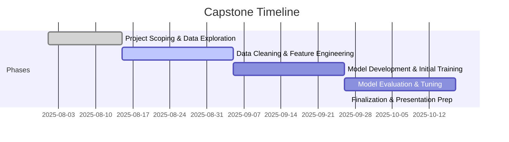

A clear schedule of all major project milestones and deadlines.

## Project Roadmap

```mermaid
gantt
    title Capstone Timeline
    dateFormat  YYYY-MM-DD
    section Phases
    Project Scoping & Data Exploration     :done,    p1, 2025-08-01, 14d
    Data Cleaning & Feature Engineering    :active,  p2, 2025-08-15, 21d
    Model Development & Initial Training   :         p3, 2025-09-05, 21d
    Model Evaluation & Tuning              :         p4, 2025-09-26, 21d
    Finalization & Presentation Prep       :         p5, 2025-10-17, 14da
```

## Key Dates
- Proposal Due
- Midterm Check-in
- Final Presentation
